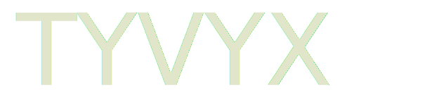

# TYVYX WiFi Drone Controller



> Reverse-engineered AI control system for cheap Chinese hobby drones

Cheap WiFi drones from Amazon — like the **K417** and similar sub-$50 models — ship with a basic Android app and no open API. This project reverse-engineers their UDP control protocol and RTSP video stream to replace the stock app with a full AI-capable control stack: computer vision, autonomous navigation, SLAM, and a modern web interface.

The goal is to use these mass-produced, disposable hobby drones as a low-cost platform for AI and robotics research.

## Overview

These drones communicate over a simple WiFi hotspot using an undocumented UDP command protocol and an RTSP video feed. By sniffing traffic between the drone and its official Android app, we reconstructed the full command set and built a Python control layer on top of it.

From there, the project adds what the manufacturer never intended: optical flow position estimation, YOLO object detection, autonomous flight planning, and a React web interface — all running on commodity hardware with no drone modifications required.

**Project Status**:
- ✅ Phase 1: Flight control calibration tools
- ✅ Phase 2: React + FastAPI modern web interface
- 🚧 Phase 3-7: Autonomous navigation (in progress)

## Features

### Core Functionality

- ✅ **UDP Command Protocol** - Reverse-engineered control commands
- ✅ **RTSP Video Streaming** - Real-time video with OpenCV
- ✅ **Camera Switching** - Toggle between multiple cameras
- ✅ **Device Auto-Detection** - Identify GL/TC drone types
- ✅ **Network Diagnostics** - Connection testing and troubleshooting

### Advanced Capabilities

- 🚀 **Modern Web Interface** - React + TypeScript UI (Phase 2)
- 🚀 **FastAPI Backend** - Async REST API with WebSocket telemetry
- 🎯 **Flight Control Calibration** - Interactive testing tools (Phase 1)
- 🤖 **Autonomous Navigation Framework** - PID controllers and path planning
- 👁️ **YOLO11 Integration** - Real-time object detection
- 📊 **Real-time Telemetry** - WebSocket-based status streaming

### Experimental

- ⚠️ **Flight Controls** - Throttle, pitch, roll, yaw (requires calibration)
- ⚠️ **Position Estimation** - Optical flow-based dead reckoning (Phase 3)
- ⚠️ **SLAM Integration** - Visual SLAM for mapping (Phase 4+)

## Quick Start

### Prerequisites

- Python 3.8 or higher
- FFmpeg (for video streaming)
- A compatible WiFi hobby drone (K417, HD-720P-*, HD-FPV-*, HD720-*, FHD-* and similar)

### Installation

```bash
# Install Python dependencies
pip install -r requirements.txt

# Install FFmpeg
# Windows: Download from https://ffmpeg.org/ and add to PATH
# Linux: sudo apt-get install ffmpeg
# macOS: brew install ffmpeg
```

### Connect and Fly

```bash
# 1. Connect to drone WiFi (HD-720P-*, HD-FPV-*, etc.)
# 2. Verify connection
ping 192.168.1.1

# 3. Run basic controller
python -m tyvyx.drone_controller

# Or run web interface
python -m tyvyx.app
# Visit http://localhost:5000
```

### Phase 2 Web Interface

```bash
# Terminal 1: Start backend
python -m autonomous.api.main
# Backend at http://localhost:8000

# Terminal 2: Start frontend
cd frontend
npm install
npm run dev
# Frontend at http://localhost:5173
```

## Project Structure

```
TYVYX/
├── tyvyx/              # Core drone control package
│   ├── drone_controller.py          # Basic controller
│   ├── drone_controller_advanced.py # With flight controls
│   ├── drone_controller_yolo.py     # With object detection
│   ├── video_stream.py              # Video utilities
│   ├── network_diagnostics.py       # Connection testing
│   └── app.py                       # Flask web interface
│
├── autonomous/        # Autonomous navigation system
│   ├── api/          # FastAPI backend (Phase 2)
│   ├── models/       # Control models and profiles
│   ├── navigation/   # PID controllers, path planning
│   ├── services/     # High-level drone service layer
│   ├── perception/   # Computer vision, SLAM (Phase 3+)
│   ├── localization/ # Position estimation (Phase 3+)
│   ├── slam/         # SLAM engines (Phase 7)
│   └── testing/      # Flight control calibration tools
│
├── frontend/          # React + TypeScript web UI (Phase 2)
│   ├── src/
│   │   ├── App.tsx
│   │   └── services/api.ts
│   └── package.json
│
├── config/            # Configuration files
│   └── drone_config.yaml  # Main drone configuration
│
├── docs/              # Documentation
│   ├── INDEX.md              # Documentation hub
│   ├── API_REFERENCE.md      # API documentation
│   ├── getting-started/      # Setup guides
│   ├── guides/               # Phase implementation guides
│   ├── technical/            # Technical references
│   └── contributing/         # Contributor documentation
│
├── logs/              # Runtime logs
├── maps/              # Map data (Phase 4+)
└── tests/             # Unit tests
```

## Documentation

📚 **[Full Documentation](docs/INDEX.md)**

### Getting Started
- **[Setup Guide](docs/getting-started/README.md)** - Installation and first flight
- **[Quick Reference](docs/getting-started/QUICK_REFERENCE.md)** - Command cheat sheet
- **[Troubleshooting](docs/getting-started/TROUBLESHOOTING.md)** - Common issues and solutions

### Implementation Guides
- **[Phase 1: Calibration](docs/guides/phase1-calibration.md)** - Flight control calibration
- **[Phase 2: Web App](docs/guides/phase2-webapp.md)** - React + FastAPI setup
- **[YOLO Integration](docs/guides/yolo-integration.md)** - Object detection setup
- **[Turbodrone Architecture](docs/guides/turbodrone-architecture.md)** - Architecture patterns

### Technical Reference
- **[API Reference](docs/API_REFERENCE.md)** - Module and class documentation
- **[Protocol Specification](docs/technical/protocol-specification.md)** - UDP protocol details
- **[Reverse Engineering Notes](docs/technical/reverse-engineering.md)** - Protocol discovery
- **[System Architecture](docs/technical/architecture.md)** - Component relationships

### Contributing
- **[Contributing Guide](docs/contributing/CONTRIBUTING.md)** - How to contribute
- **[Development Setup](docs/contributing/DEVELOPMENT.md)** - Dev environment setup

## Roadmap

- [x] **Phase 1**: Flight control calibration ✅
- [x] **Phase 2**: React + FastAPI web interface ✅
- [ ] **Phase 3**: Optical flow position estimation 🚧
- [ ] **Phase 4**: SLAM integration
- [ ] **Phase 5**: Waypoint navigation
- [ ] **Phase 6**: Autonomous mapping
- [ ] **Phase 7**: Advanced SLAM (ORB-SLAM3, RTAB-Map)

## Usage Examples

### Basic Video Control

```python
from tyvyx.drone_controller import DroneController

controller = DroneController()
controller.connect_to_drone()
controller.start_video()
# Video window appears with live feed
```

### Advanced Flight Control

```python
from tyvyx.drone_controller_advanced import TYVYXDroneControllerAdvanced

controller = TYVYXDroneControllerAdvanced()
controller.connect_to_drone()
controller.start_video()
# Use keyboard for flight controls
```

### YOLO Object Detection

```python
from tyvyx.drone_controller_yolo import TYVYXDroneControllerYOLO

controller = TYVYXDroneControllerYOLO()
controller.connect_to_drone()
controller.start_video()
# Video with object detection overlay
```

### FastAPI Backend

```bash
# Start server
python -m autonomous.api.main

# API available at http://localhost:8000
# Docs at http://localhost:8000/docs
```

See [API Reference](docs/API_REFERENCE.md) for detailed usage.

## Contributing

Contributions welcome! We're especially interested in:

- Protocol discoveries (new UDP commands)
- Flight control calibration data
- SLAM and computer vision improvements
- Documentation enhancements
- Bug fixes and testing

**Getting Started**:
1. Read [Contributing Guidelines](docs/contributing/CONTRIBUTING.md)
2. Set up [Development Environment](docs/contributing/DEVELOPMENT.md)
3. Check open issues or create a new one
4. Submit a pull request

## Safety Warning

⚠️ **Always fly responsibly:**

- Test in open, safe areas away from people and obstacles
- Keep drone in visual line of sight at all times
- Be prepared for unexpected behavior during development
- Have emergency stop procedures ready
- Follow all local drone regulations and laws
- Never fly near airports, crowds, or restricted areas
- Ensure fully charged battery before flight testing

This is experimental software - use at your own risk!

## Network Configuration

| Service | Protocol | Address | Description |
|---------|----------|---------|-------------|
| **UDP Control** | UDP | 192.168.1.1:7099 | Command and control |
| **RTSP Video** | RTSP/TCP | 192.168.1.1:7070 | Video streaming |
| **HTTP Server** | HTTP | 192.168.1.1:80 | File access |
| **FTP Server** | FTP | 192.168.1.1:21 | File transfer |

See [Protocol Specification](docs/technical/protocol-specification.md) for details.

## Technology Stack

**Backend**: Python 3.8+, FastAPI, Flask, OpenCV, NumPy, Ultralytics YOLO11
**Frontend**: React 18, TypeScript, Vite, Tailwind CSS
**Communication**: UDP, RTSP, WebSocket, REST API
**Development**: pytest, ruff, black, ESLint, Prettier

## Host Hardware

AI inference runs on the control laptop — not the drone itself (the drone has no compute beyond its flight controller).

| Component | Spec |
|-----------|------|
| **Platform** | Windows laptop |
| **GPU** | NVIDIA RTX 3090 (sm_86, 24 GB VRAM) |
| **Driver** | 581.57 (CUDA 12.x capable) |
| **Python** | 3.8 (venv) |

The RTX 3090 handles all GPU-accelerated workloads: YOLO11 inference, future SLAM pipelines, and depth estimation models. Wherever a choice exists between CPU and GPU execution, **prefer CUDA** — the bottleneck in this system is latency, and the 3090 will outperform any CPU fallback significantly.

### GPU Usage by Component

| Component | Status | Notes |
|-----------|--------|-------|
| YOLO11 inference | 🎯 Use `device="cuda"` | Ultralytics auto-selects if available |
| OpenCV optical flow | ✅ CUDA + CPU fallback | `cv2.cuda.SparsePyrLKOpticalFlow` auto-selected |
| Future depth models | 🎯 GPU | PyTorch `model.to("cuda")` |
| Future ORB-SLAM3 | 🎯 GPU | Compile with CUDA support |

## Supported Drone Models

These drones all share the same WiFi + UDP + RTSP architecture and are broadly compatible:

| Model | Notes |
|-------|-------|
| **K417** (Amazon) | Primary development hardware |
| HD-720P-* | Tested and working |
| HD-FPV-* | Tested and working |
| HD720-* | Compatible |
| FHD-* | Compatible |

Any cheap WiFi drone that creates a hotspot at `192.168.1.1`, streams RTSP on port 7070, and accepts UDP commands on port 7099 is likely compatible. These are sold under dozens of brand names on Amazon and AliExpress — the firmware is nearly identical across all of them.

## Acknowledgments

- **Turbodrone Project** - Architecture patterns for autonomous navigation
- **OpenCV Community** - Video processing libraries
- **Ultralytics** - YOLO11 object detection
- **FastAPI** - Modern async web framework

## License

Educational purposes only. Use at your own risk.

This project is not affiliated with or endorsed by any drone manufacturer. All trademarks are property of their respective owners. The reverse engineering was performed for interoperability purposes.

---

**Ready to start?** Check out the [Getting Started Guide](docs/getting-started/README.md)!

**Need help?** See [Troubleshooting](docs/getting-started/TROUBLESHOOTING.md) or open an issue.